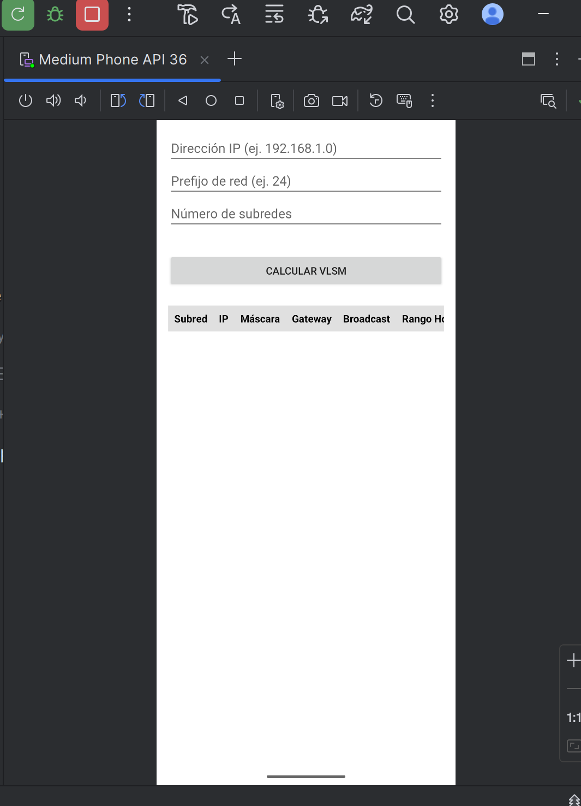
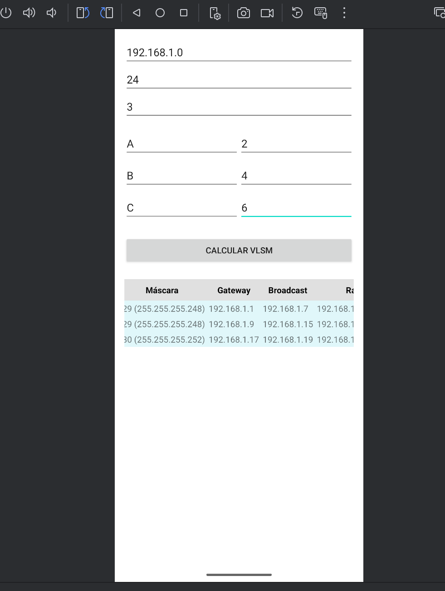
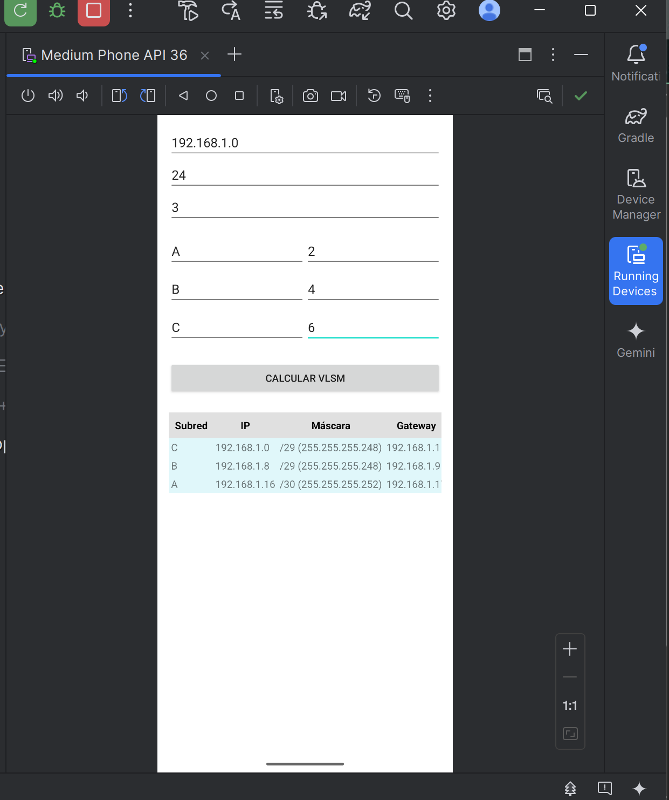
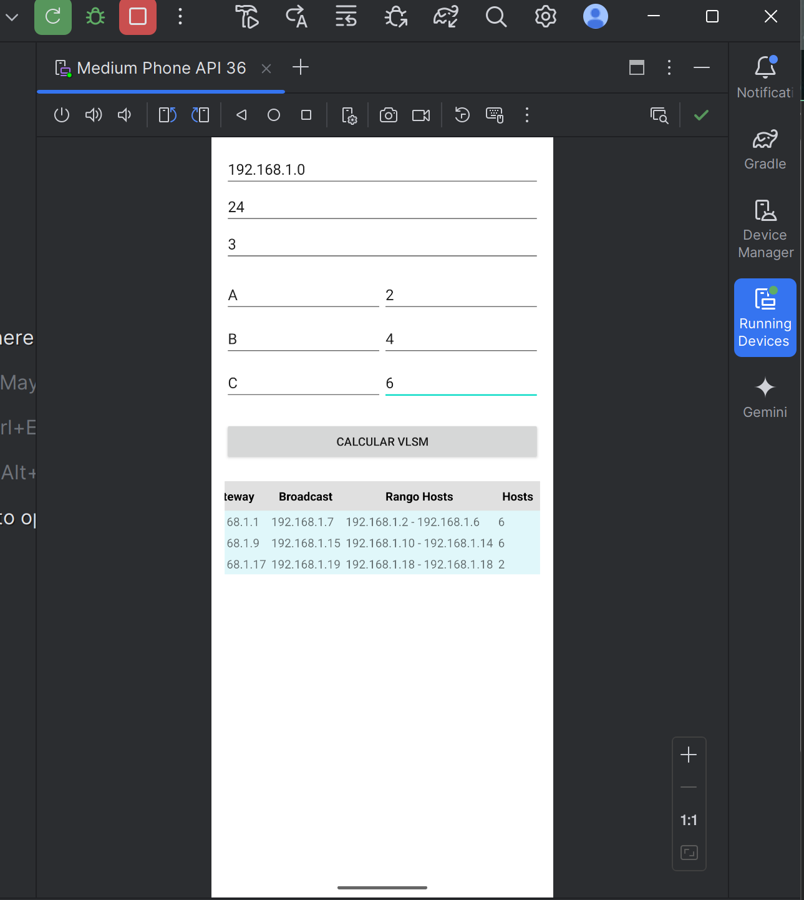

# Calculadora VLSM

Calculadora VLSM es una aplicación desarrollada en Android que permite calcular subredes utilizando una dirección IP base, el número de subredes deseadas y la cantidad de hosts requeridos para cada subred. Esta herramienta facilita la planificación de redes al automatizar el proceso de subneteo con máscaras de longitud variable (VLSM).

## Características

- **Entrada de datos**: Permite ingresar la dirección IP base, el prefijo de red y el número de subredes.
- **Cálculo automático**: Genera subredes optimizadas según la cantidad de hosts especificados.
- **Visualización de resultados**: Muestra información detallada de cada subred, incluyendo:
  - Dirección IP de la subred
  - Máscara de subred
  - Dirección de gateway
  - Dirección de broadcast
  - Rango de hosts disponibles
  - Número total de hosts

## Capturas de pantalla

## Cómo usar

1. Ingresa la dirección IP base (por ejemplo, `192.168.1.0`).
2. Especifica el prefijo de red (por ejemplo, `24`).
3. Indica el número de subredes que deseas crear.
4. Para cada subred, introduce la cantidad de hosts requeridos.
5. Presiona el botón "Calcular VLSM" para obtener los resultados.

